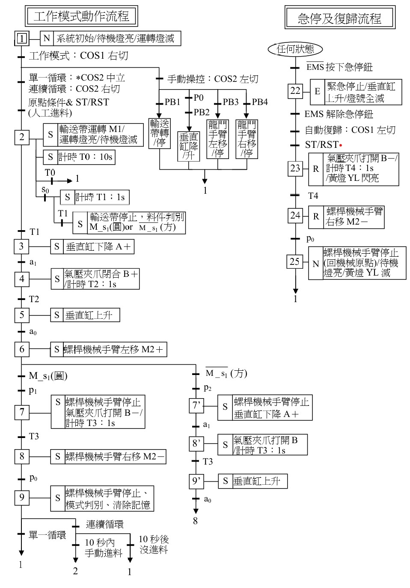

# ShapeRecognition

## 簡介

**題目：形狀判別與傳送**  
本專案主要示範了一套**簡易自動化設備**的模擬流程，包括「**手動操作**」、「**單一循環**」與「**連續循環**」三種模式，
並提供「**復歸 (Reset)**」及「**急停 (Emergency Stop)**」功能，可根據使用者指令/按鈕切換模式，並於程式中以事件迴圈
實現流程控制、急停、料件數量更新等，能在程式控制層面與 UI 介面上動態顯示。

- **開發環境**：Visual Studio  
- **介面軟體開發**：Qt Designer  
- **語法**：C++

---

## 系統流程圖

以上是程式的主要邏輯流程示意。

---

## 操作須知

1. **設備原點**  
   - 設為 `ArmPosition` 與 `CylinderUpLimit` 都為 `true`，若不在原點，則無法啟動設備。
2. **龍門移動與復歸**  
   - 如果手動操作移動了龍門手臂，會使 `ArmPosition`（手臂原點）消失，需要重新復歸後才能再次啟動設備。
3. **復歸流程**  
   - 必須在「復歸模式 (ModeSwitch_Left)」與「單一或連續模式關閉」的狀態下，才能啟動復歸流程回原點。
4. **垂直氣缸**  
   - 模擬「3口2位電磁閥」，所以當手動操作中鬆開按鈕時，氣缸會自動復歸原點。
5. **進料判斷**  
   - 未實作實際的倒數 10 秒判斷；若檢測料件不足就直接待機。
6. **取料優先權**  
   - 預設為圓料優先（不含 FIFO 機制）。後加入方料或其他料時，會先取圓料再方料。

> **注意**：程式可能仍有一些小 Bug，但不影響主要流程運行。若遇到問題請包涵。

---

## 可以改善的地方

1. **使用多執行緒 (thread-based) 替代原本的 while 迴圈**  
   - 將目前「阻塞式 `while`」邏輯改為後臺執行緒：  
     - 手動模式、單一循環、連續循環都可以在後臺執行，而不是在主程式中阻塞。
2. **急停偵測拆分為獨立執行緒**  
   - 讓一條執行緒專門「持續偵測急停」，一旦偵測到就立即呼叫 `triggerEmergencyStop()`，使系統可以更即時地中斷。
3. **取料機制改為 FIFO**  
   - 目前是「圓料優先」；若要更貼近實務工廠排程，可改用 FIFO 或其他先進先出 / 先進後出策略。

---

## 未來可以增加的功能

1. **建立小型資料庫**  
   - 將料件的數量、形狀、處理狀態等資訊儲存在資料庫中，方便後端查詢與統計分析。  
2. **GUI / HMI 優化**  
   - 改善操作介面、加入更多狀態監視與歷史紀錄，提升可視化程度。  

---

## 展示影片

1. **連結到外部平台**  
   - [YouTube](https://youtu.be/PynCtSuIcUI)

---

## 聯絡方式

若有任何問題或建議，歡迎提出 Issue 或聯絡 maintainer。謝謝使用！
